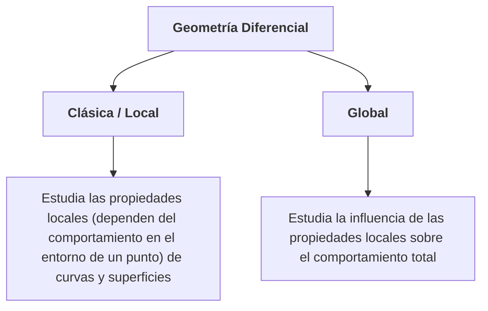

# Introducción a la Geometría Diferencial

La geometría diferencial es la disciplina matemática que utiliza las herramientas del análisis matemático y el álgebra lineal para estudiar la geometría de curvas y superficies en el espacio euclidiano $\mathbb{R}^3$.

Esta disciplina se divide tradicionalmente en dos vertientes principales estrechamente vinculadas:
1. **Geometría diferencial clásica o local**: Se ocupa fundamentalmente del estudio de las **propiedades "locales" de las curvas y superficies**, es decir, de aquellas características que dependen de manera exclusiva del comportamiento del objeto en un entorno (o pedazo) arbitrariamente pequeño alrededor de un punto
2. **Geometría diferencial global**: Esta vertiente se encarga de estudiar **la influencia que tienen las propiedades locales sobre el comportamiento total (global y a menudo topológico) de la curva o superficie en su conjunto**.

Dado que la herramienta analítica fundamental para este estudio es el cálculo diferencial, las curvas y superficies se definen mediante funciones que pueden diferenciarse un determinado número de veces (funciones suaves).

{/* En esta primera sección, abordaremos las ideas intuitivas del concepto de curva y cómo la noción intuitiva de traza debe formalizarse para diferenciar la curva como función de su imagen geométrica en el espacio. */}

