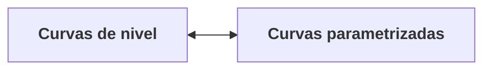

# Curvas Parametrizadas

Denotaremos por $\mathbb{R}^3$ al conjunto de tripletes $(x,y,z)$ de números reales. Nuestro objetivo es caracterizar ciertos subconjuntos de $\mathbb{R}^3$ que llamaremos curvas, que son, en cierto sentido, uno-dimensionales y a los que puedan aplicarse los métodos del cálculo diferencial. Una manera natural de definir tales subconjuntos es a través de funciones diferecibles. Decimos que una función real de una variable real es *diferenciable* (o *suave*) si admite, en todos los puntos, derivadas de todos los órdenes (que son automáticamente continuas).

## Dos conceptualizaciones de la noción intuitiva de curva:

1. **Como conjunto de puntos:**

$C=\{(x,y)\in\mathbb{R}^2 \mid f(x,y)=c\}$

Ejemplos:
- $y-2x=1$ (línea recta).
- $y-x^2=0$ (parábola).
- $x^2+y^2-1=0$ (circunferencia).

Estas curvas se denominan "curvas de nivel", y pueden describirse mediante la ecuación cartesiana $f(x,y)=c$, donde $f$ es una función de $x$ e $y$ y $c$ una constante. Desde este punto de vista, un curva es un conjunto de puntos $(x,y)$ en el plano $\mathbb{R}^2$, pero también podemos considerar curvas en $\mathbb{R}^3$ — por ejemplo, el eje $x$ en $\mathbb{R}^3$ es la línea recta dada por

$y=0,\quad z=0$,

y más generalmente una curva en $\mathbb{R}^3$ puede definirse por un par de ecuaciones

$f_1(x,y,z) = c_1,\quad f_2(x,y,z) = c_2$.

En $\mathbb{R}^3$, una curva tiene dimensión 1, mientras que el espacio tiene dimensión 3. Cada ecuación independiente $f(x,y,z)=c$ impone una restricción y, en condiciones regulares, reduce la dimensión en una unidad: una sola ecuación describe normalmente una superficie (dimensión 2), mientras que dos ecuaciones independientes $f_1(x,y,z)=c_1$ y $f_2(x,y,z)=c_2$ describen la intersección de dos superficies, que generalmente es una curva (dimensión 1). Por eso, para definir una curva de forma implícita en $\mathbb{R}^3$ suelen ser necesarias dos ecuaciones.

Podemos asumir que la constante $c$ siempre es cero, reescribiendo $g(x,y) = f(x,y)-c = 0$, podemos decir que la curva es el conjunto de puntos en los que la función $g(x, y)$ se anula ($z=0$). De esta manera, al reducir la ecuación implícita a cero, la curva queda "acostada" sobre el plano $xy$ reduciendo el problema a uno bidimensional.

2. **Como la trayectoria trazada por un punto en movimiento:** 
Si $\alpha(t)$ es la posición del punto en el tiempo $t$, la curva se describe como una función $\alpha$ de un paráemtro escalar $t$ con valores vectoriales (en $\mathbb{R}^2$ para una curva plana, en $\mathbb{R}^3$ para una curva en el espacio).

Una **curva parametrizada diferenciable** es una función diferenciable $ \alpha: I \to \mathbb{R}^n$ de un intervalo $I=(a,b)$ de la recta real $\mathbb{R}$ en $\mathbb{R}^n$.

La palabra *diferenciable* en esta definición significa que $\alpha$ es una correspondencia que aplica cada $t\in I$ en un punto $\alpha(t)=(x(t),y(t),z(t)) \in \mathbb{R}^3$, de forma que cada una de sus funciones componentes ($x(t),y(t),z(t)$) es una función diferenciable.

Una curva parametrizada, cuya imagen está contenida en una curva de nivel $C$, se denomina **parametrización** de (una parte de) $C$.

**Observaciones**:
1. En la definición, no se exige que $\alpha$ no sea inyectiva. Lo que  significa que la imagen de $\alpha$ puede tener *autointersecciones* (nodos). Ejemplo: la aplicación $\alpha: \mathbb{R}\to\mathbb{R}^2$, dada por $\alpha(t)=(t^3-4t, t^2-4)$, con $t\in\mathbb{R}$ es una curva parametrizada diferenciable. Nótese que $\alpha(2)=\alpha(-2)=(0,0)$, es decir, la aplicación $\alpha$ no es *inyectiva*.

2. La imagen de $\alpha$ (denotada $\alpha(I)$) puede tener puntos singulares (cúspides). Puesto que $\alpha$ es diferenciable, es decir, está compuesto por funciones suaves, uno podría pensar que la imagen de $\alpha$ es suave, sin puntos angulosos; lo cual no es cierto: $\alpha$ puede contener puntos angulosos o cúspides incluso si todas sus componentes son suaves. Ejemplo: $\alpha(t)=(t^3,t^2)$. Su traza $\alpha(I)$ es la gráfica de la función $y=x^{2/3}$, cuya gráfica tiene una cúspide en el origen $(0,0)$, a pesar de ser $\alpha$ una curva parametrizada diferenciable.

Como podemos observar, algunas paremetrizacioens diferenciables "ocultan" estas características de la curva en las que el vector tangente no está bien definido. Por ello, introduciremos luego el concepto de **regularidad** exigiendo una condición más fuerte sobre las curvas parametrizadas diferenciables. 

3. Incluso si $\alpha$ es una aplicación inyectiva, $\alpha$ podría **no** ser un *homeomorfismo* sobre su imagen.

### La sutileza topológica de las curvas inyectivas
Cuando estudiamos curvas parametrizadas, es intuitivo notar que si una curva presenta una autointersección (un nodo o bucle explícito), la topología de su imagen será fundamentalmente distinta a la de su dominio (no puedes "desenrollar" esa curva en un solo intervalo sin perder la continuidad o la inyectividad). Al existir un cruce, la imagen deja de ser homeomorfa al intervalo original (una línea recta).

  <iframe 
    className="w-full aspect-video rounded-lg border border-slate-200 dark:border-slate-800"
    src="https://www.youtube.com/embed/ai7l1F2uMtM" 
    title="Curva paramétrica plana"
    allow="accelerometer; autoplay; clipboard-write; encrypted-media; gyroscope; picture-in-picture" 
    allowFullScreen
  ></iframe>

Sin embargo, cabe preguntarse: ¿son las autointersecciones explícitas la única manera de alterar la topología al pasar de la recta al plano?
La respuesta es no; el fenómeno puede darse de una manera mucho más sutil. Para ilustrar esto, consideremos el **Folium de Descartes**. Tomemos la parametrización $\alpha: (-1, \infty) \to \mathbb{R}^2$ dada por:

$$ \alpha(t) = \left( \frac{3t}{1+t^3}, \frac{3t^2}{1+t^3} \right) $$

Esta curva también puede caracterizarse mediante su ecuación cartesiana polinómica: $x^3 + y^3 = 3xy$. Este es un ejemplo fascinante porque nuestra función $\alpha$ es estrictamente inyectiva en el intervalo $(-1, \infty)$; es decir, para cada valor finito de $t$, la curva visita un punto distinto del plano. Nunca se "choca" consigo misma. Podríamos asumir ingenuamente que, al no haber autointersecciones, la imagen será topológicamente idéntica (homeomorfa) a la recta real estándar de su dominio.

  <iframe 
    className="w-full aspect-video rounded-lg border border-slate-200 dark:border-slate-800"
    src="https://www.youtube.com/embed/QYjM8_Aw2Ss" 
    title="¿Por qué el Folium de Descartes NO es homeomorfo a una recta?"
    allow="accelerometer; autoplay; clipboard-write; encrypted-media; gyroscope; picture-in-picture" 
    allowFullScreen
  ></iframe>

Sin embargo, esto es falso, y todo se reduce a lo que ocurre en el entorno del punto $(0,0)$.La topología inducida por el planoLa topología de la imagen de esta curva no vive en el vacío, sino que es una topología de subespacio inducida por el plano $\mathbb{R}^2$. Por definición, los conjuntos abiertos en nuestra curva se obtienen tomando conjuntos abiertos del plano (como discos o bolas sin borde) y calculando su intersección con la curva $\alpha(-1, \infty)$.Si tomamos una pequeña vecindad abierta (un disco) alrededor del origen $(0,0)$ en el plano $\mathbb{R}^2$, su intersección con la imagen de la curva captura simultáneamente dos porciones totalmente desconectadas en el tiempo:El arco central de la curva que pasa por el origen cuando $t = 0$ (es decir, un intervalo donde $t \approx 0$).La rama asintótica de la curva que converge hacia $(0,0)$ cuando $t \to \infty$.Esto significa que cualquier vecindad abierta del punto $(0,0)$ en la topología de la imagen será homeomorfa a un pequeño intervalo alrededor de $t=0$, más una porción separada que corresponde a la "cola" asintótica en el infinito.En la topología estándar del intervalo $(-1, \infty)$, una vecindad de $t=0$ es simplemente un único segmento continuo ininterrumpido. Como la vecindad en la imagen contiene partes "extra" pegadas por la proximidad en el espacio geométrico, esta topología no es homeomorfa al intervalo estándar $(-1, \infty)$.ConclusiónLa imagen de una curva, aunque esté definida sobre un simple intervalo y no posea cruces, puede ser topológicamente más complicada que su dominio. Formar un bucle o un nodo cerrado es una manera obvia de alterar la topología, pero el comportamiento asintótico —donde una rama infinita se "acumula" o converge hacia un punto ya visitado— es una forma alternativa, sutil y matemáticamente hermosa de romper el homeomorfismo.

---

## Cuestionario Conceptual

Valida tus conocimientos fundamentales de la diferencia entre diferenciable y suave:

<QuizMultipleChoice 
  question="¿Cuál es la diferencia entre diferenciable y suave?"
  options={[
    "Son sinónimos (no existe diferencia).",
    "Diferenciable implica suave.",
    "Diferenciable significa que la función admite (al menos) una primera derivada, suave (smooth) implica que admite derivadas de todos los órdenes."
  ]}
  correctIndex={2}
  explanation="La palabra diferenciable se refiere a la capacidad de la función de tener derivadas, mientras que suave implica que estas derivadas existen en todos los órdenes (es decir, es infinitamente derivable o de clase $C^\infty$). En el contexto de este curso, se utilizan como sinónimos, pero es importante conocer la distinción matemática."
/>

---

El vector derivado $\alpha'(t)$ en el punto $t \in I$ se denomina el **vector tangente** o vector velocidad de la curva en $t$.

## Definición de Derivada Vectorial

Si expresamos $\alpha(t)$ en términos de sus funciones coordenadas:

$$\alpha(t) = (x(t), y(t), z(t))$$

Entonces el vector tangente viene dado por la derivada de cada una de sus componentes:

$$\alpha'(t) = \left( \frac{dx}{dt}, \frac{dy}{dt}, \frac{dz}{dt} \right) = \left(x'(t), y'(t), z'(t) \right)$$

Físicamente, la norma del vector tangente $\|\alpha'(t)\|$ representa la **rapidez** o velocidad escalar del movimiento en el instante $t$.

---

## Cuestionario sobre Vector Tangente

Valida tu comprensión del vector velocidad:

<QuizMultipleChoice 
  question="Si una curva paramétrica tiene la forma $\alpha(t) = (t^2, t^3, 0)$, ¿cuál es su vector tangente en $t = 1$?"
  options={[
    "$(2, 3, 0)$",
    "$(1, 1, 0)$",
    "$(2, 6, 0)$",
    "$(0, 0, 0)$"
  ]}
  correctIndex={0}
  explanation="Derivando cada componente de $\alpha(t)$ obtenemos $\alpha'(t) = (2t, 3t^2, 0)$. Evaluando en $t = 1$ resulta $\alpha'(1) = (2, 3, 0)$."
/>

---

## Desafío de Velocidad Constante

<SemanticEval 
  prompt="Si una curva parametrizada tiene rapidez constante $\|\alpha'(t)\| = c$ para todo $t$, demuestra formalmente que el vector velocidad $\alpha'(t)$ y el vector aceleración $\alpha''(t)$ son ortogonales en todo punto."
/>

El **conjunto imagen** $\alpha(I)\subset\mathbb{R}^3$ se denomina **traza**  de $\alpha$ y representa el conjunto de puntos del espacio ocupados por la curva (no confundir con la parametrización, que es una función).

## Traza vs. Parametrización

Intuitivamente, una curva es el camino que describe un punto en movimiento. Sin embargo, matemáticamente debemos diferenciar dos conceptos:
1. **La traza (o imagen)**: Es el conjunto de puntos del espacio ocupados por la curva. Es un objeto puramente geométrico.
2. **La parametrización**: Es la función que describe *cómo* se recorre esa traza a lo largo del tiempo.

Por ejemplo, las funciones $\alpha(t) = (\cos t, \sin t)$ y $\beta(t) = (\cos 2t, \sin 2t)$ tienen la misma traza (la circunferencia unitaria), pero describen movimientos con velocidades distintas.

$$\alpha(t) \neq \beta(t) \quad \text{aunque} \quad \alpha(I) = \beta(I)$$

---

## Cuestionario Conceptual

Valida tus conocimientos fundamentales de la diferencia entre traza y parametrización:

<QuizMultipleChoice 
  question="¿Cuál de las siguientes afirmaciones describe de manera exacta la relación entre una curva diferencial y su traza?"
  options={[
    "Dos parametrizaciones totalmente distintas pueden dar lugar a la misma traza geométrica.",
    "La traza define unívocamente a la parametrización de la curva.",
    "Una curva diferenciable tiene infinitas trazas asociadas.",
    "La traza es una función y la parametrización es un conjunto."
  ]}
  correctIndex={0}
  explanation="Como se muestra en el ejemplo de la circunferencia unitaria, distintas parametrizaciones (como cambiar la velocidad del recorrido) dan lugar al mismo conjunto geométrico de puntos (traza)."
/>

---

## Desafío de Análisis

Demuestra formalmente tu comprensión completando la justificación del siguiente desafío teórico:

<SemanticEval 
  prompt="Explica la diferencia matemática entre una curva paramétrica diferenciable y su traza en $\mathbb{R}^2$. Da un contraejemplo de una parametrización cuya traza tenga una esquina o cúspide pero cuya función sea infinitamente diferenciable."
/>

## Curva plana
Decimos que $\alpha$ es una **curva plana** si existe un plano $P \subset \mathbb{R}^3$ tal que la curva $\alpha$ está contenida en el plano $P$. Simbólicamente: $\alpha(I)\subset P$.

**Nota**: Un movimiento rígido en el espacio (una traslación seguida de una rotación ortogonal) preserva intactas todas las propiedades geométricas intrínsecas de la curva, como su longitud de arco, su curvatura y su torsión nula. Gracias a esto, puedes aplicar un movimiento rígido para trasladar y rotar ese plano arbitrario $P$ hasta hacerlo coincidir perfectamente con el plano $xy$. Al hacer esto, garantizas que la tercera coordenada espacial de la curva se anule ($z=0$) para todo punto de su traza, lo cual, es la convención habitual al estudiar curvas planas en el espacio tridimensional. Siempre podemos pensar al plano $P$ como el plano $xy$, luego de la transformación (cambio de coordenadas) nuestra parametrización quedará $\alpha(t)=(x(t),y(t),0)=(x(t),y(t))$.

El siguiente video ilustra lo expuesto anteriormente:

  <iframe 
    className="w-full aspect-video rounded-lg border border-slate-200 dark:border-slate-800"
    src="https://www.youtube.com/embed/cAad0Wdvqxw" 
    title="Curva paramétrica plana"
    allow="accelerometer; autoplay; clipboard-write; encrypted-media; gyroscope; picture-in-picture" 
    allowFullScreen
  ></iframe>

## Ejemplos de pasaje

## Ejemplos

  <iframe 
    className="w-full aspect-video rounded-lg border border-slate-200 dark:border-slate-800"
    src="https://www.youtube.com/embed/c-bCggA1AFc" 
    title="Ejemplo de pasaje entre curvas paramétricas y ecuaciones cartesianas"
    allow="accelerometer; autoplay; clipboard-write; encrypted-media; gyroscope; picture-in-picture" 
    allowFullScreen
  ></iframe>

### Algunas parametrizaciones:
1. **Líneas**: $\alpha(t)=t \mathbf{v}+\mathbf{v}_0$, donde $\mathbf{v}, \mathbf{v}_0 \in \mathbb{R}^n, \mathbf{v} \neq \mathbf{0}$ con $t\in\mathbb{R}$.
2. **Círculos**: $\alpha(t)= \mathbf{c} + r\left(\cos \dfrac{t}{r},\sin \dfrac{t}{r}\right)$, donde $\mathbf{c}\in\mathbb{R}^2, r>0, t\in [0,2\pi r]$.

La división por $r$ aparece porque el parámetro $t$ no es un ángulo, sino la longitud de arco recorrida sobre la circunferencia.

Recordemos una relación básica de geometría:

$s = r\theta$

donde:
- $s$ es la longitud de arco,
- $r$ es el radio,
- $\theta$ es el ángulo (en radianes).

Si queremos usar como parámetro la longitud de arco $t=s$, entonces:

$\theta = \frac{t}{r}$.

Por eso la parametrización se escribe:

$\alpha(t) = \mathbf{c} + r\left(\cos \frac{t}{r}, \sin \frac{t}{r}\right)$.

¿Qué se consigue con esto? Al derivar:

$\alpha'(t) = \left(-\sin \frac{t}{r}, \cos \frac{t}{r}\right)$,

y su norma es:

$\|\alpha'(t)\| = 1$.

Es decir, el punto se mueve con **velocidad unitaria**. Cada incremento de una unidad en $t$ corresponde a recorrer exactamente una unidad de longitud sobre la circunferencia. Por eso se dice que la curva está **parametrizada por longitud de arco**.

3. **Espirales** (o **hélices** en el espacio):

$\alpha(t)=\left(a\cdot \cos \dfrac{t}{\sqrt{a^2+b^2}},a\cdot \sin \dfrac{t}{\sqrt{a^2+b^2}}, \dfrac{b\cdot t}{\sqrt{a^2+b^2}}\right)$

donde $t\in\mathbb{R}$ y $a,b\neq 0$.

Esa parametrización está escrita por longitud de arco, y por eso aparecen esos factores $\sqrt{a^2+b^2}$ que la hacen verse más complicada.

La hélice "natural" suele escribirse como:

$\beta(\theta) = (a\cos\theta, a\sin\theta, b\theta)$

donde:
- $a$ es el radio de la hélice,
- $b$ controla cuánto asciende por cada vuelta,
- $\theta$ es el ángulo.

Comprender la trayectoria de una hélice en el espacio tridimensional resulta mucho más sencillo cuando descomponemos su movimiento en dos partes fundamentales: lo que ocurre en el suelo (el plano base) y lo que ocurre con su altura.

Para ilustrar esto, analizaremos la parametrización de una hélice dada por:

$$ \alpha(t) = \left(a\cos\frac{t}{c}, a\sin\frac{t}{c}, \frac{bt}{c}\right) $$

Donde la constante $c = \sqrt{a^2+b^2}$ garantiza que la curva esté parametrizada por longitud de arco, es decir, que el punto se mueva a una velocidad constante igual a 1.

  <iframe 
    className="w-full aspect-video rounded-lg border border-slate-200 dark:border-slate-800"
    src="https://www.youtube.com/embed/59BAf2K73gA" 
    title="Intuición geometrica de la parametrización de una hélice"
    allow="accelerometer; autoplay; clipboard-write; encrypted-media; gyroscope; picture-in-picture" 
    allowFullScreen
  ></iframe>

1. **La Proyección en el Plano (Vista 2D)**. Si ignoramos por un momento la altura y "aplastamos" la hélice contra el suelo (haciendo que su coordenada $z = 0$), nos quedan únicamente las dos primeras componentes: $\left(a\cos\frac{t}{c}, a\sin\frac{t}{c}\right)$.
Como podemos observar en la primera parte de la animación, esta proyección no es otra cosa que la parametrización clásica de una circunferencia centrada en el origen. Si comparamos nuestra proyección con la fórmula general de una circunferencia parametrizada por longitud de arco: $$ \gamma(t) = \mathbf{c} + r\left(\cos \frac{t}{r}, \sin \frac{t}{r}\right) $$. Notamos que nuestra hélice tiene exactamente el comportamiento de un círculo perfecto de radio $r = a$ y centro $\mathbf{c}=(0,0)$. Geométricamente, esto significa que, sin importar cuánto ascienda el punto, su "sombra" siempre estará dando vueltas en círculos a una distancia fija del eje central.

2. **El Ascenso (La Dimensión Vertical)**. La magia tridimensional ocurre al reincorporar la tercera componente: $\frac{bt}{c}$.
A diferencia de las componentes $x$ e $y$ que oscilan cíclicamente (gracias al seno y al coseno), la coordenada $z$ depende linealmente del tiempo $t$. Esto significa que por cada vuelta que el punto da alrededor del cilindro imaginario base, sube una cantidad fija y constante. Es esta combinación de **rotación uniforme** y **ascenso lineal** la que dibuja el característico resorte o espira de la hélice.

3. **El Juego de Perspectivas**. Para comprobar visualmente que nuestra intuición analítica es correcta, la animación utiliza la cámara para ofrecernos dos vistas reveladoras:
- **Vista Cenital (Desde arriba)**: Al mirar la hélice exactamente desde arriba y corregir la distorsión de la perspectiva mediante un *zoom out*, la altura desaparece por completo ante nuestros ojos. Lo que antes era un resorte tridimensional se colapsa visualmente en el círculo perfecto de radio $a$ que calculamos en nuestra proyección inicial.
- **Vista Lateral (De perfil)**: Al mirar la curva de lado, perdemos la percepción de la profundidad. Lo que presenciamos es el ascenso constante del punto acompañado del movimiento oscilatorio de acercarse y alejarse (una onda senoidal), confirmando que la velocidad de subida no sufre aceleraciones ni frenazos.

**Conclusión**: Una hélice parametrizada por longitud de arco es simplemente el matrimonio geométrico perfecto entre un movimiento circular uniforme en el plano horizontal y un desplazamiento rectilíneo uniforme en el eje vertical.